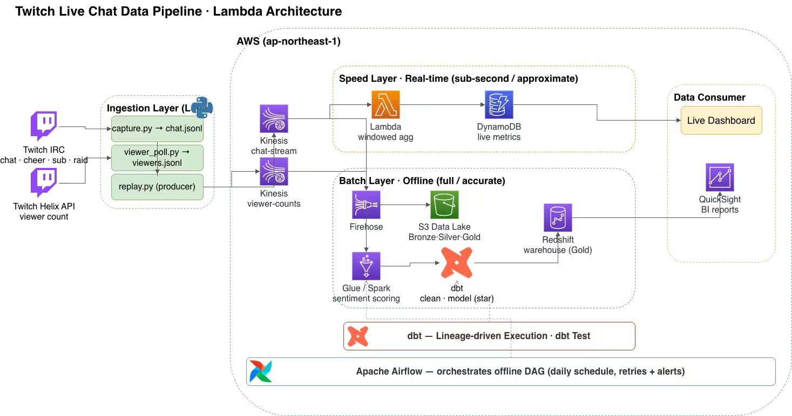
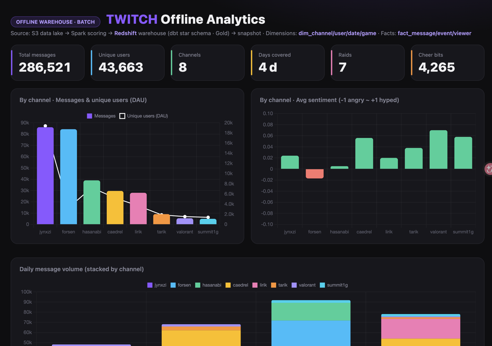
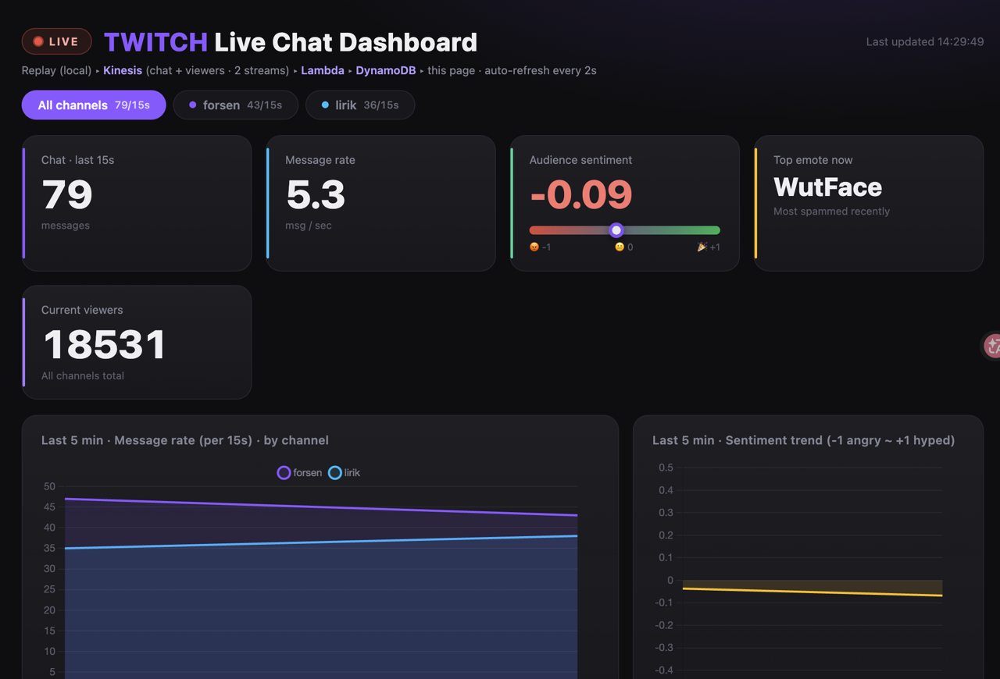
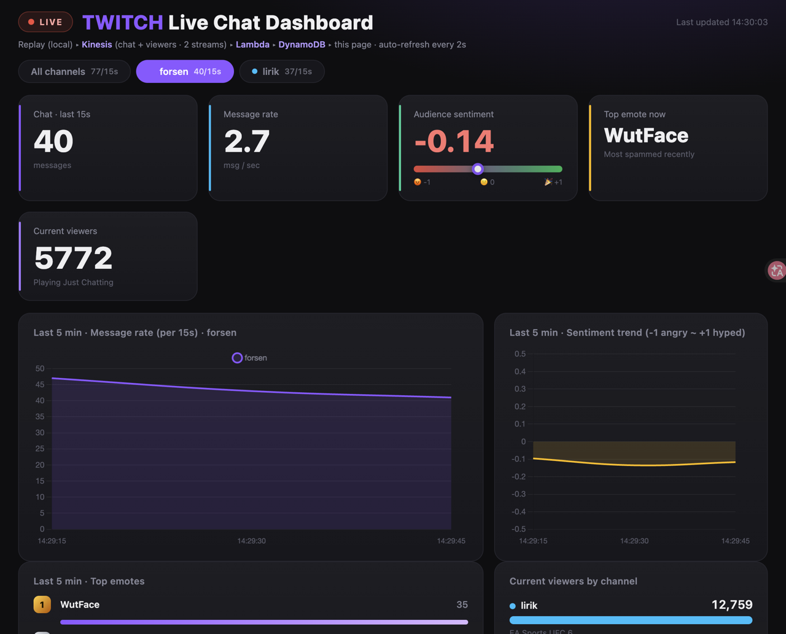
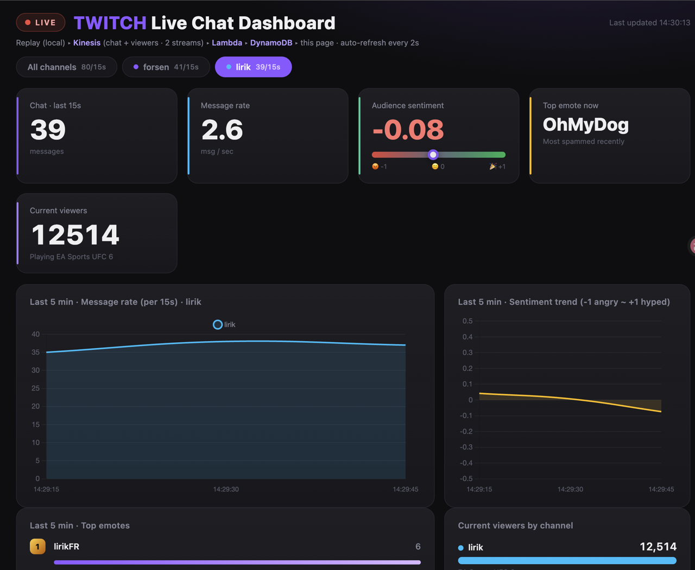

# Twitch Chat Data Pipeline — Lambda Architecture on AWS

An end-to-end data-engineering project on real Twitch chat data (~290K messages, 8 channels).
It implements a **Lambda architecture**: a **speed layer** for live metrics and a **batch layer**
that builds a dimensional warehouse for analytics.

> Real data, real AWS deployment. Streaming side reacts in seconds; batch side rebuilds a
> star-schema warehouse and serves BI dashboards.

---

## Architecture



- **Speed layer** answers *"what is happening right now"* (live message rate, sentiment, top emotes, viewers).
- **Batch layer** answers *"what happened and why"* (per-channel daily reports, revenue events, raid attribution) on a clean star schema.

---

## Dashboards

**Offline analytics** — batch layer, served from the Redshift Gold star schema (snapshot):



**Live chat** — speed layer, Kinesis → Lambda → DynamoDB, auto-refreshing every 2s:



The live view has a per-channel tab; selecting one drills the whole board down to that channel:

| forsen | lirik |
|---|---|
|  |  |

---

## Tech stack

| Layer | Tooling |
|---|---|
| Streaming ingest | Amazon **Kinesis Data Streams** (2 streams) |
| Stream processing | **AWS Lambda** (Python) — shared VADER scoring lib |
| Realtime serving | **DynamoDB** (composite key + TTL) + Lambda Function URL dashboard |
| Data lake | **Amazon S3** — Bronze, Parquet |
| Batch processing | **AWS Glue (Spark / PySpark)** — distributed sentiment scoring |
| Catalog | **Glue Data Catalog** (Crawler) |
| Warehouse | **Redshift Serverless** + **Redshift Spectrum** |
| Modeling | **dbt** — Silver + Gold star schema, data-quality tests |
| Orchestration | **Airflow** (`dags/`) |
| BI | **Superset** chart SQL (`dashboards/`) + serverless Chart.js dashboards |
| IaC | **Terraform** (`infra/`) |
| CI / tests | **GitHub Actions** + **pytest** |
| Packaging | **Docker** |
| Sentiment | **VADER** + custom Twitch-emote lexicon |

---

## Repository layout

```
.
├── dags/                 # Airflow DAG — orchestrates the batch pipeline
├── glue_jobs/            # PySpark job — distributed VADER sentiment scoring
├── dbt/                  # dbt project — Silver + Gold star schema + tests
├── scripts/              # ingestion / replay / realtime Lambda / warehouse build
├── dashboards/           # BI — chart SQL + deployed serverless dashboards
├── results/              # verified outputs (snapshot, validation log)
├── tests/                # pytest — unit tests for the sentiment scorer
├── infra/                # Terraform — IaC for the AWS resources
├── docs/                 # screenshots + data dictionary + runbook
├── .github/workflows/    # CI (lint + tests + dbt parse)
├── Dockerfile  Makefile  requirements.txt  .gitignore
└── architecture_diagram.svg / .drawio
```

---

## Data model (Gold, star schema)

Built by dbt in `dbt/models/`. Grain-first dimensional design:

- **Fact tables** (one business process / grain each): `fact_message` (one chat line),
  `fact_event` (one discrete event: raid / sub / resub), `fact_viewer` (one viewer-count sample).
- **Dimensions** (the recurring "group by" axes): `dim_channel`, `dim_user`, `dim_date`, `dim_game`.
- **Tests**: uniqueness, not-null, and referential-integrity (relationships) on keys.

Full column reference: [`docs/DATA_DICTIONARY.md`](docs/DATA_DICTIONARY.md).

---

## Quickstart

```bash
make install                       # or: pip install -r requirements.txt

# --- Batch layer (offline warehouse) ---
make dbt-build                     # build + test Silver + Gold (dbt run + dbt test)
make snapshot                      # query Gold -> results/dashboard_snapshot.json
make deploy-dashboards             # push snapshot into the BI Lambda

# --- Speed layer (live) ---
make replay CH=chat_forsen.jsonl   # replay chat -> Kinesis (loops)
```

Raw commands are in the [`Makefile`](Makefile); the batch flow also runs as an Airflow DAG in [`dags/`](dags/).

---

## Testing & CI

- `make test` runs **pytest** ([`tests/`](tests/)) — unit tests for the VADER + emote sentiment scorer.
- **GitHub Actions** ([`.github/workflows/ci.yml`](.github/workflows/ci.yml)) runs lint + tests + `dbt parse` on every push / PR.

## Infrastructure

[`infra/`](infra/) is **Terraform** that recreates the whole AWS stack (Kinesis, DynamoDB, S3, Glue,
Redshift Serverless): `cd infra && terraform init && terraform apply -var="account_id=<acct>"`.

## Docs

- [`docs/DATA_DICTIONARY.md`](docs/DATA_DICTIONARY.md) — column-level reference for every table
- [`docs/RUNBOOK.md`](docs/RUNBOOK.md) — run / refresh / troubleshoot / teardown

---

## Results (verified on AWS)

| Metric | Value |
|---|---|
| Messages modeled (`fact_message`) | 286,521 |
| Unique users (`dim_user`) | 43,663 |
| Channels | 8 |
| Raids attributed | 7 |
| dbt data-quality tests | 8 / 8 passing |

Full snapshot: [`results/dashboard_snapshot.json`](results/dashboard_snapshot.json).

---

## What is actually deployed vs. represented

Being explicit (this matters):

- **Deployed & verified on AWS:** Kinesis → Lambda → DynamoDB → live dashboard; S3 → Glue Spark →
  Crawler → Redshift Spectrum → dbt models (8/8 tests) → BI dashboard.
- **`dags/`** encodes the batch flow as an Airflow DAG (the same dbt build + test steps). Runs on any Airflow/MWAA.
- **`infra/`** is Terraform that codifies the resources (created via CLI/console during dev) — apply it to rebuild from scratch.
- **`dashboards/`** holds the BI chart SQL; the dashboards actually shipped are the serverless
  `dashboards/offline_dashboard_lambda.py` and `dashboards/realtime_dashboard_lambda.py`.
